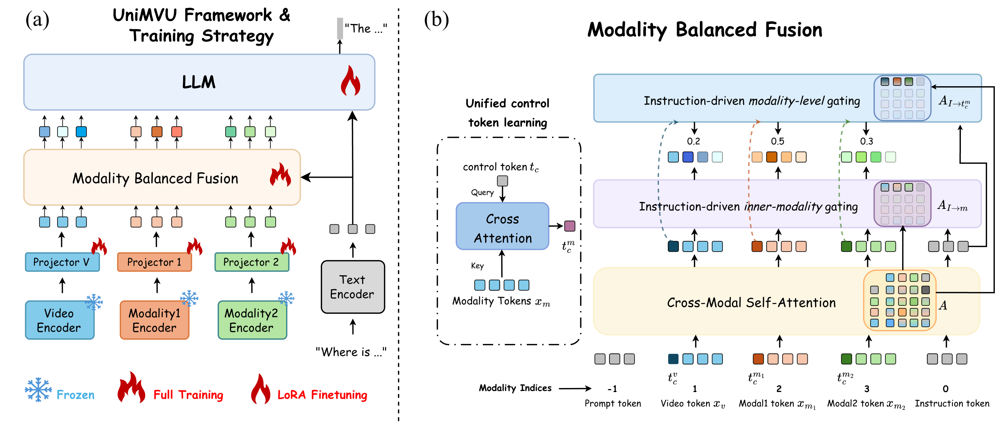
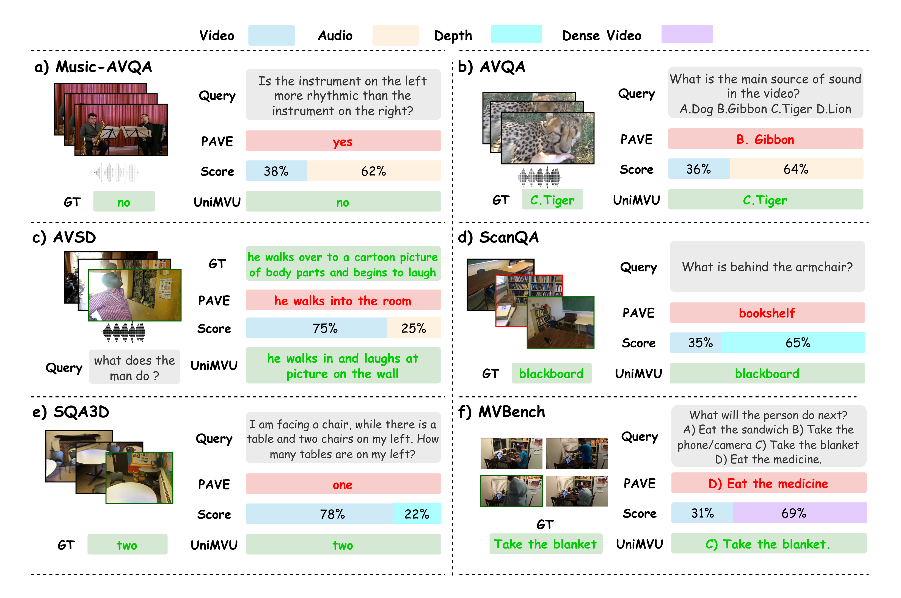
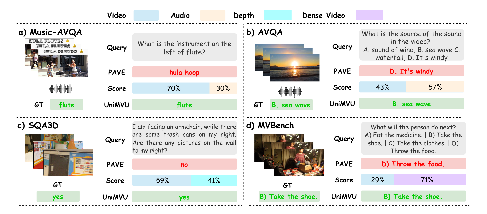
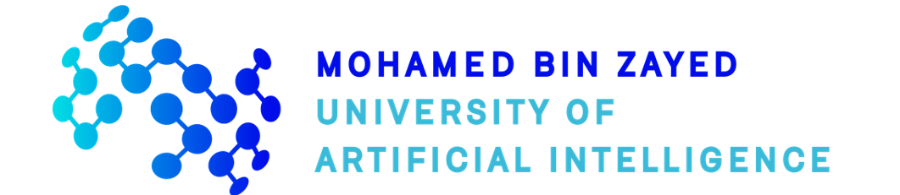

<div align="center">

# UniMVU: Not All Modalities Are Equal

<p align="center">
  
</p>

[Bonan Ding](https://github.com/TLDBN)<sup>1</sup> · [Umair Nawaz](https://github.com/umair1221)<sup>1</sup> · [Ufaq Khan](https://scholar.google.co.kr/citations?user=UYljgNAAAAAJ&hl=en)<sup>1</sup> · [Abdelrahman M. Shaker](https://amshaker.github.io)<sup>1</sup> · [Muhammad Haris Khan](https://scholar.google.com/citations?user=ZgERfFwAAAAJ&hl=en)<sup>1</sup> · [Jiale Cao](https://jialecao001.github.io)<sup>2</sup> · [Jin Xie](https://scholar.google.com/citations?user=T2A8B2EAAAAJ&hl=en)<sup>3</sup> · [Fahad Shahbaz Khan](https://scholar.google.es/citations?user=zvaeYnUAAAAJ&hl=en)<sup>1,4</sup>

<sup>1</sup>Mohamed bin Zayed University of Artificial Intelligence &nbsp;·&nbsp; <sup>2</sup>Tianjin University &nbsp;·&nbsp; <sup>3</sup>Chongqing University &nbsp;·&nbsp; <sup>4</sup>Linköping University

<p>
  <a href="https://TLDBN.github.io/UniMVU/">
    
  </a>
  <a href="https://arxiv.org/abs/YOUR_ARXIV_ID">
    
  </a>
  <a href="https://huggingface.co/BonanDing/UniMVU">
    
  </a>
</p>

</div>

---

**UniMVU** is a unified multimodal video understanding framework that adaptively balances video, audio, depth, and long-video evidence via **instruction-aware gating** — allocating attention where it matters, query by query.


<p align="center">
  
</p>

<p align="center">
  <strong>Instruction-aware gating dynamically reweights modalities for each query instead of applying a fixed fusion recipe to every sample.</strong>
</p>

---

## 📑 Table of Contents

- [Abstract](#-abstract)
- [Highlights](#-highlights)
- [Supported Benchmarks](#-supported-benchmarks)
- [Main Results](#-main-results)
- [Qualitative Results](#-qualitative-results)
- [Installation](#%EF%B8%8F-installation)
- [Data Preparation](#-data-preparation)
- [Training](#-training)
- [Evaluation](#-evaluation)
- [Repository Layout](#-repository-layout)
- [Citation](#-citation)
- [Acknowledgements](#-acknowledgements)

---

## 📖 Abstract

> Pre-trained video large language models excel at visual reasoning, but they struggle when videos arrive with auxiliary streams such as audio, depth maps, or high-frame-rate inputs. In these settings, uniform fusion can introduce modality interference and let irrelevant channels distract the model. UniMVU addresses this with **instruction-aware fusion** across video, audio, depth, and other modalities via two dynamic gating stages: **feature-level gates** emphasize salient regions within each modality, while **modality-level gates** reweight whole streams based on the input instruction. Across six benchmarks — AVQA, AVSD, Music-AVQA, ScanQA, SQA3D, and MVBench — UniMVU delivers consistent gains over static-fusion baselines, with improvements of up to **+13.5 CIDEr** on AVSD.

<p align="center">
  
  <br>
  <em>Overview of UniMVU and its instruction-aware multimodal fusion design.</em>
</p>

---

## ✨ Highlights

| Feature | Description |
| :---: | :--- |
| 🎯 **Instruction-Aware Gating** | Dynamic gating at both feature and modality levels — each query selectively routes attention to the relevant data streams only. |
| 🏗️ **Unified Model Family** | One architecture covers audio-video QA, 3D QA, and long-video QA across six benchmarks. |
| 🧩 **Clean Public Interface** | Centered on `train.py`, `train_uni.py`, `unified_eval.py`, and `lmms_eval_start.py` for straightforward reproducibility. |
| 🔄 **Flexible Training Modes** | Per-task single-dataset training and unified multi-task training are both supported via public launch scripts. |

---

## 🌐 Supported Benchmarks

| Task Family | Benchmarks | Modalities |
| :--- | :--- | :--- |
| 🎵 Audio-Video QA | Music-AVQA, AVQA, AVSD | Video + Audio |
| 🧊 3D QA | ScanQA, SQA3D | Video + Depth |
| 📹 Long-Video QA | MVBench | Video (extended) |

## 📊 Main Results

Evaluation across audio-video QA, 3D QA, and long-video QA. `PAVE*` denotes our reproduction using the public PAVE code. UniMVU<sup>&dagger;</sup> refers to the jointly trained multi-task model reported in the paper. For ScanQA and SQA3D, refined scores are shown in parentheses where reported.

### 🎵 Audio-Visual QA

#### Music-AVQA

<table>
  <thead>
    <tr>
      <th>Scale</th>
      <th>Method</th>
      <th>Audio Avg.</th>
      <th>Visual Avg.</th>
      <th>AV Avg.</th>
      <th>Overall Avg.</th>
    </tr>
  </thead>
  <tbody>
    <tr bgcolor="#ffffff">
      <td bgcolor="#ffffff" rowspan="5" align="center"><strong>7B</strong></td>
      <td bgcolor="#ffffff"><a href="https://github.com/rikeilong/Bay-CAT">CAT-FT</a></td>
      <td bgcolor="#ffffff"><strong>84.9</strong></td>
      <td bgcolor="#ffffff">86.1</td>
      <td bgcolor="#ffffff"><strong>83.2</strong></td>
      <td bgcolor="#ffffff"><strong>84.3</strong></td>
    </tr>
    <tr bgcolor="#ffffff">
      <td bgcolor="#ffffff"><a href="https://github.com/LLaVA-VL/LLaVA-NeXT">LLaVA-OV-FT (video-only)</a></td>
      <td bgcolor="#ffffff">75.4</td>
      <td bgcolor="#ffffff">89.3</td>
      <td bgcolor="#ffffff">72.3</td>
      <td bgcolor="#ffffff">77.4</td>
    </tr>
    <tr bgcolor="#ffffff">
      <td bgcolor="#ffffff"><a href="https://github.com/dragonlzm/PAVE">PAVE*</a></td>
      <td bgcolor="#ffffff">79.1</td>
      <td bgcolor="#ffffff">92.7</td>
      <td bgcolor="#ffffff">77.8</td>
      <td bgcolor="#ffffff">81.9</td>
    </tr>
    <tr bgcolor="#dbeafe">
      <td bgcolor="#dbeafe"><a href="https://huggingface.co/BonanDing/UniMVU/tree/main/unimvu_uni_7B">UniMVU<sup>&dagger;</sup></a></td>
      <td bgcolor="#dbeafe">78.9</td>
      <td bgcolor="#dbeafe">92.8</td>
      <td bgcolor="#dbeafe">77.2</td>
      <td bgcolor="#dbeafe">81.6</td>
    </tr>
    <tr bgcolor="#dbeafe">
      <td bgcolor="#dbeafe"><a href="https://huggingface.co/BonanDing/UniMVU/tree/main/unimvu_7B_music_avqa">UniMVU</a></td>
      <td bgcolor="#dbeafe">81.7</td>
      <td bgcolor="#dbeafe"><strong>93.5</strong></td>
      <td bgcolor="#dbeafe">79.8</td>
      <td bgcolor="#dbeafe">83.7</td>
    </tr>
  </tbody>
  <tbody>
    <tr bgcolor="#ffffff">
      <td bgcolor="#ffffff" rowspan="8" align="center"><strong>0.5B</strong></td>
      <td bgcolor="#ffffff"><a href="https://github.com/TXH-mercury/VAST">VAST</a></td>
      <td bgcolor="#ffffff">-</td>
      <td bgcolor="#ffffff">-</td>
      <td bgcolor="#ffffff">-</td>
      <td bgcolor="#ffffff">80.7</td>
    </tr>
    <tr bgcolor="#ffffff">
      <td bgcolor="#ffffff"><a href="https://ojs.aaai.org/index.php/AAAI/article/view/33138">AVAF-Net</a></td>
      <td bgcolor="#ffffff">78.1</td>
      <td bgcolor="#ffffff">82.3</td>
      <td bgcolor="#ffffff">72.1</td>
      <td bgcolor="#ffffff">75.9</td>
    </tr>
    <tr bgcolor="#ffffff">
      <td bgcolor="#ffffff"><a href="https://arxiv.org/abs/2510.18346">AV-Master</a></td>
      <td bgcolor="#ffffff"><strong>79.9</strong></td>
      <td bgcolor="#ffffff">86.5</td>
      <td bgcolor="#ffffff">74.2</td>
      <td bgcolor="#ffffff">78.5</td>
    </tr>
    <tr bgcolor="#ffffff">
      <td bgcolor="#ffffff"><a href="https://github.com/LLaVA-VL/LLaVA-NeXT">LLaVA-OV-FT (video-only)</a></td>
      <td bgcolor="#ffffff">69.6</td>
      <td bgcolor="#ffffff">76.3</td>
      <td bgcolor="#ffffff">62.8</td>
      <td bgcolor="#ffffff">67.6</td>
    </tr>
    <tr bgcolor="#ffffff">
      <td bgcolor="#ffffff"><a href="https://github.com/LLaVA-VL/LLaVA-NeXT">LLaVA-OV-FT* (video-audio concat)</a></td>
      <td bgcolor="#ffffff">76.2</td>
      <td bgcolor="#ffffff">89.1</td>
      <td bgcolor="#ffffff">72.4</td>
      <td bgcolor="#ffffff">77.5</td>
    </tr>
    <tr bgcolor="#ffffff">
      <td bgcolor="#ffffff"><a href="https://github.com/dragonlzm/PAVE">PAVE*</a></td>
      <td bgcolor="#ffffff">75.9</td>
      <td bgcolor="#ffffff">88.6</td>
      <td bgcolor="#ffffff">72.4</td>
      <td bgcolor="#ffffff">77.3</td>
    </tr>
    <tr bgcolor="#dbeafe">
      <td bgcolor="#dbeafe"><a href="https://huggingface.co/BonanDing/UniMVU/tree/main/unimvu_uni_0.5B">UniMVU<sup>&dagger;</sup></a></td>
      <td bgcolor="#dbeafe">77.2</td>
      <td bgcolor="#dbeafe">90.2</td>
      <td bgcolor="#dbeafe">74.8</td>
      <td bgcolor="#dbeafe">79.3</td>
    </tr>
    <tr bgcolor="#dbeafe">
      <td bgcolor="#dbeafe"><a href="https://huggingface.co/BonanDing/UniMVU/tree/main/unimvu_0.5B_music_avqa">UniMVU</a></td>
      <td bgcolor="#dbeafe">79.5</td>
      <td bgcolor="#dbeafe"><strong>91.8</strong></td>
      <td bgcolor="#dbeafe"><strong>76.7</strong></td>
      <td bgcolor="#dbeafe"><strong>81.9</strong></td>
    </tr>
  </tbody>
</table>

#### AVQA & AVSD

<table>
  <thead>
    <tr>
      <th>Scale</th>
      <th>Method</th>
      <th>AVQA ACC (%)</th>
      <th>AVSD ROUGE-L</th>
      <th>AVSD CIDEr</th>
    </tr>
  </thead>
  <tbody>
    <tr bgcolor="#ffffff">
      <td bgcolor="#ffffff" rowspan="4" align="center"><strong>7B</strong></td>
      <td bgcolor="#ffffff"><a href="https://github.com/LLaVA-VL/LLaVA-NeXT">LLaVA-OV-FT (video-only)</a></td>
      <td bgcolor="#ffffff">90.8</td>
      <td bgcolor="#ffffff">-</td>
      <td bgcolor="#ffffff">124.9</td>
    </tr>
    <tr bgcolor="#ffffff">
      <td bgcolor="#ffffff"><a href="https://github.com/dragonlzm/PAVE">PAVE*</a></td>
      <td bgcolor="#ffffff">93.4</td>
      <td bgcolor="#ffffff">38.5</td>
      <td bgcolor="#ffffff">151.6</td>
    </tr>
    <tr bgcolor="#dbeafe">
      <td bgcolor="#dbeafe"><a href="https://huggingface.co/BonanDing/UniMVU/tree/main/unimvu_uni_7B">UniMVU<sup>&dagger;</sup></a></td>
      <td bgcolor="#dbeafe">92.2</td>
      <td bgcolor="#dbeafe">39.5</td>
      <td bgcolor="#dbeafe">162.7</td>
    </tr>
    <tr bgcolor="#dbeafe">
      <td bgcolor="#dbeafe">UniMVU (<a href="https://huggingface.co/BonanDing/UniMVU/tree/main/unimvu_7B_avqa">AVQA</a> / <a href="https://huggingface.co/BonanDing/UniMVU/tree/main/unimvu_7B_avsd">AVSD</a>)</td>
      <td bgcolor="#dbeafe"><strong>94.3</strong></td>
      <td bgcolor="#dbeafe"><strong>39.8</strong></td>
      <td bgcolor="#dbeafe"><strong>165.1</strong></td>
    </tr>
  </tbody>
  <tbody>
    <tr bgcolor="#ffffff">
      <td bgcolor="#ffffff" rowspan="7" align="center"><strong>0.5B</strong></td>
      <td bgcolor="#ffffff"><a href="https://github.com/GeWu-Lab/PSTP-Net">PSTP-Net</a></td>
      <td bgcolor="#ffffff">90.2</td>
      <td bgcolor="#ffffff">-</td>
      <td bgcolor="#ffffff">-</td>
    </tr>
    <tr bgcolor="#ffffff">
      <td bgcolor="#ffffff"><a href="https://arxiv.org/abs/2510.18346">AV-Master</a></td>
      <td bgcolor="#ffffff">91.4</td>
      <td bgcolor="#ffffff">-</td>
      <td bgcolor="#ffffff">-</td>
    </tr>
    <tr bgcolor="#ffffff">
      <td bgcolor="#ffffff"><a href="https://github.com/LLaVA-VL/LLaVA-NeXT">LLaVA-OV-FT (video-only)</a></td>
      <td bgcolor="#ffffff">86.4</td>
      <td bgcolor="#ffffff">-</td>
      <td bgcolor="#ffffff">117.6</td>
    </tr>
    <tr bgcolor="#ffffff">
      <td bgcolor="#ffffff"><a href="https://github.com/LLaVA-VL/LLaVA-NeXT">LLaVA-OV-FT* (video-audio concat)</a></td>
      <td bgcolor="#ffffff">89.9</td>
      <td bgcolor="#ffffff">35.7</td>
      <td bgcolor="#ffffff">127.8</td>
    </tr>
    <tr bgcolor="#ffffff">
      <td bgcolor="#ffffff"><a href="https://github.com/dragonlzm/PAVE">PAVE*</a></td>
      <td bgcolor="#ffffff">89.6</td>
      <td bgcolor="#ffffff">36.5</td>
      <td bgcolor="#ffffff">134.9</td>
    </tr>
    <tr bgcolor="#dbeafe">
      <td bgcolor="#dbeafe"><a href="https://huggingface.co/BonanDing/UniMVU/tree/main/unimvu_uni_0.5B">UniMVU<sup>&dagger;</sup></a></td>
      <td bgcolor="#dbeafe">91.1</td>
      <td bgcolor="#dbeafe">37.8</td>
      <td bgcolor="#dbeafe">145.9</td>
    </tr>
    <tr bgcolor="#dbeafe">
      <td bgcolor="#dbeafe">UniMVU (<a href="https://huggingface.co/BonanDing/UniMVU/tree/main/unimvu_0.5B_avqa">AVQA</a> / <a href="https://huggingface.co/BonanDing/UniMVU/tree/main/unimvu_0.5B_avsd">AVSD</a>)</td>
      <td bgcolor="#dbeafe"><strong>92.3</strong></td>
      <td bgcolor="#dbeafe"><strong>38.2</strong></td>
      <td bgcolor="#dbeafe"><strong>147.1</strong></td>
    </tr>
  </tbody>
</table>

### 🧊 3D QA

#### ScanQA

<table>
  <thead>
    <tr>
      <th>Scale</th>
      <th>Method</th>
      <th>EM@1</th>
      <th>BLEU-4</th>
      <th>METEOR</th>
      <th>ROUGE-L</th>
      <th>CIDEr</th>
    </tr>
  </thead>
  <tbody>
    <tr bgcolor="#ffffff">
      <td bgcolor="#ffffff" rowspan="6" align="center"><strong>7B</strong></td>
      <td bgcolor="#ffffff"><a href="https://github.com/ZCMax/LLaVA-3D">LLaVA-3D-7B</a></td>
      <td bgcolor="#ffffff">27.0 (45.0)</td>
      <td bgcolor="#ffffff">14.5</td>
      <td bgcolor="#ffffff"><strong>20.7</strong></td>
      <td bgcolor="#ffffff"><strong>50.1</strong></td>
      <td bgcolor="#ffffff">91.7</td>
    </tr>
    <tr bgcolor="#ffffff">
      <td bgcolor="#ffffff"><a href="https://openaccess.thecvf.com/content/WACV2025/papers/Fu_Scene-LLM_Extending_Language_Model_for_3D_Visual_Reasoning_WACV_2025_paper.pdf">Scene-LLM-7B</a></td>
      <td bgcolor="#ffffff">27.2</td>
      <td bgcolor="#ffffff">12.0</td>
      <td bgcolor="#ffffff">16.6</td>
      <td bgcolor="#ffffff">40.0</td>
      <td bgcolor="#ffffff">80.0</td>
    </tr>
    <tr bgcolor="#ffffff">
      <td bgcolor="#ffffff"><a href="https://github.com/LLaVA-VL/LLaVA-NeXT">LLaVA-OV-FT (video-only)</a></td>
      <td bgcolor="#ffffff">27.4 (46.3)</td>
      <td bgcolor="#ffffff">-</td>
      <td bgcolor="#ffffff">13.5</td>
      <td bgcolor="#ffffff">47.4</td>
      <td bgcolor="#ffffff">95.1</td>
    </tr>
    <tr bgcolor="#ffffff">
      <td bgcolor="#ffffff"><a href="https://github.com/dragonlzm/PAVE">PAVE*</a></td>
      <td bgcolor="#ffffff">28.9 (48.2)</td>
      <td bgcolor="#ffffff">16.0</td>
      <td bgcolor="#ffffff">19.8</td>
      <td bgcolor="#ffffff">48.8</td>
      <td bgcolor="#ffffff">102.4</td>
    </tr>
    <tr bgcolor="#dbeafe">
      <td bgcolor="#dbeafe"><a href="https://huggingface.co/BonanDing/UniMVU/tree/main/unimvu_uni_7B">UniMVU<sup>&dagger;</sup></a></td>
      <td bgcolor="#dbeafe">29.2 (<strong>48.8</strong>)</td>
      <td bgcolor="#dbeafe"><strong>17.83</strong></td>
      <td bgcolor="#dbeafe">20.1</td>
      <td bgcolor="#dbeafe">49.01</td>
      <td bgcolor="#dbeafe"><strong>104.2</strong></td>
    </tr>
    <tr bgcolor="#dbeafe">
      <td bgcolor="#dbeafe"><a href="https://huggingface.co/BonanDing/UniMVU/tree/main/unimvu_7B_scanqa">UniMVU</a></td>
      <td bgcolor="#dbeafe"><strong>29.6</strong> (<strong>48.8</strong>)</td>
      <td bgcolor="#dbeafe">16.0</td>
      <td bgcolor="#dbeafe">19.8</td>
      <td bgcolor="#dbeafe">49.0</td>
      <td bgcolor="#dbeafe">102.7</td>
    </tr>
  </tbody>
  <tbody>
    <tr bgcolor="#ffffff">
      <td bgcolor="#ffffff" rowspan="7" align="center"><strong>0.5B</strong></td>
      <td bgcolor="#ffffff"><a href="https://dl.acm.org/doi/pdf/10.1145/3731715.3733426">SceSU</a></td>
      <td bgcolor="#ffffff">25.1</td>
      <td bgcolor="#ffffff">13.2</td>
      <td bgcolor="#ffffff">14.9</td>
      <td bgcolor="#ffffff">35.5</td>
      <td bgcolor="#ffffff">69.6</td>
    </tr>
    <tr bgcolor="#ffffff">
      <td bgcolor="#ffffff"><a href="https://github.com/LZ-CH/DSPNet">DSPNet</a></td>
      <td bgcolor="#ffffff"><strong>26.5</strong></td>
      <td bgcolor="#ffffff"><strong>15.4</strong></td>
      <td bgcolor="#ffffff">15.7</td>
      <td bgcolor="#ffffff">39.3</td>
      <td bgcolor="#ffffff">78.1</td>
    </tr>
    <tr bgcolor="#ffffff">
      <td bgcolor="#ffffff"><a href="https://github.com/LLaVA-VL/LLaVA-NeXT">LLaVA-OV-FT (video-only)</a></td>
      <td bgcolor="#ffffff">20.5 (36.3)</td>
      <td bgcolor="#ffffff">6.5</td>
      <td bgcolor="#ffffff">14.3</td>
      <td bgcolor="#ffffff">36.9</td>
      <td bgcolor="#ffffff">70.5</td>
    </tr>
    <tr bgcolor="#ffffff">
      <td bgcolor="#ffffff"><a href="https://github.com/LLaVA-VL/LLaVA-NeXT">LLaVA-OV-FT (video-3d concat)</a></td>
      <td bgcolor="#ffffff">10.2 (24.3)</td>
      <td bgcolor="#ffffff">4.9</td>
      <td bgcolor="#ffffff">7.4</td>
      <td bgcolor="#ffffff">20.2</td>
      <td bgcolor="#ffffff">34.9</td>
    </tr>
    <tr bgcolor="#ffffff">
      <td bgcolor="#ffffff"><a href="https://github.com/dragonlzm/PAVE">PAVE*</a></td>
      <td bgcolor="#ffffff">23.5 (40.4)</td>
      <td bgcolor="#ffffff">12.7</td>
      <td bgcolor="#ffffff">17.1</td>
      <td bgcolor="#ffffff">42.7</td>
      <td bgcolor="#ffffff">84.9</td>
    </tr>
    <tr bgcolor="#dbeafe">
      <td bgcolor="#dbeafe"><a href="https://huggingface.co/BonanDing/UniMVU/tree/main/unimvu_uni_0.5B">UniMVU<sup>&dagger;</sup></a></td>
      <td bgcolor="#dbeafe">24.7 (42.0)</td>
      <td bgcolor="#dbeafe">14.5</td>
      <td bgcolor="#dbeafe">17.9</td>
      <td bgcolor="#dbeafe">44.2</td>
      <td bgcolor="#dbeafe">89.7</td>
    </tr>
    <tr bgcolor="#dbeafe">
      <td bgcolor="#dbeafe"><a href="https://huggingface.co/BonanDing/UniMVU/tree/main/unimvu_0.5B_scanqa">UniMVU</a></td>
      <td bgcolor="#dbeafe">25.9 (<strong>43.2</strong>)</td>
      <td bgcolor="#dbeafe">13.5</td>
      <td bgcolor="#dbeafe"><strong>18.0</strong></td>
      <td bgcolor="#dbeafe"><strong>44.7</strong></td>
      <td bgcolor="#dbeafe"><strong>90.9</strong></td>
    </tr>
  </tbody>
</table>

#### SQA3D

<table>
  <thead>
    <tr>
      <th>Scale</th>
      <th>Method</th>
      <th>EM@1</th>
      <th>What</th>
      <th>Is</th>
      <th>How</th>
    </tr>
  </thead>
  <tbody>
    <tr bgcolor="#ffffff">
      <td bgcolor="#ffffff" rowspan="6" align="center"><strong>7B</strong></td>
      <td bgcolor="#ffffff"><a href="https://github.com/ZCMax/LLaVA-3D">LLaVA-3D-7B</a></td>
      <td bgcolor="#ffffff">55.6 (57.6)</td>
      <td bgcolor="#ffffff">-</td>
      <td bgcolor="#ffffff">-</td>
      <td bgcolor="#ffffff">-</td>
    </tr>
    <tr bgcolor="#ffffff">
      <td bgcolor="#ffffff"><a href="https://openaccess.thecvf.com/content/WACV2025/papers/Fu_Scene-LLM_Extending_Language_Model_for_3D_Visual_Reasoning_WACV_2025_paper.pdf">Scene-LLM-7B</a></td>
      <td bgcolor="#ffffff">54.2</td>
      <td bgcolor="#ffffff">-</td>
      <td bgcolor="#ffffff">-</td>
      <td bgcolor="#ffffff">-</td>
    </tr>
    <tr bgcolor="#ffffff">
      <td bgcolor="#ffffff"><a href="https://github.com/LLaVA-VL/LLaVA-NeXT">LLaVA-OV-FT (video-only)</a></td>
      <td bgcolor="#ffffff">55.8 (58.1)</td>
      <td bgcolor="#ffffff">-</td>
      <td bgcolor="#ffffff">-</td>
      <td bgcolor="#ffffff">-</td>
    </tr>
    <tr bgcolor="#ffffff">
      <td bgcolor="#ffffff"><a href="https://github.com/dragonlzm/PAVE">PAVE*</a></td>
      <td bgcolor="#ffffff">57.6 (59.9)</td>
      <td bgcolor="#ffffff">52.3 (56.9)</td>
      <td bgcolor="#ffffff">69.2 (69.9)</td>
      <td bgcolor="#ffffff">56.3 (57.4)</td>
    </tr>
    <tr bgcolor="#dbeafe">
      <td bgcolor="#dbeafe"><a href="https://huggingface.co/BonanDing/UniMVU/tree/main/unimvu_uni_7B">UniMVU<sup>&dagger;</sup></a></td>
      <td bgcolor="#dbeafe">58.1 (60.4)</td>
      <td bgcolor="#dbeafe">52.3 (56.6)</td>
      <td bgcolor="#dbeafe">70.7 (71.8)</td>
      <td bgcolor="#dbeafe"><strong>60.4</strong> (<strong>61.1</strong>)</td>
    </tr>
    <tr bgcolor="#dbeafe">
      <td bgcolor="#dbeafe"><a href="https://huggingface.co/BonanDing/UniMVU/tree/main/unimvu_7B_sqa3d">UniMVU</a></td>
      <td bgcolor="#dbeafe"><strong>59.4</strong> (<strong>61.6</strong>)</td>
      <td bgcolor="#dbeafe"><strong>53.4</strong> (<strong>57.7</strong>)</td>
      <td bgcolor="#dbeafe"><strong>75.9</strong> (<strong>76.8</strong>)</td>
      <td bgcolor="#dbeafe">55.9 (56.1)</td>
    </tr>
  </tbody>
  <tbody>
    <tr bgcolor="#ffffff">
      <td bgcolor="#ffffff" rowspan="6" align="center"><strong>0.5B</strong></td>
      <td bgcolor="#ffffff"><a href="https://dl.acm.org/doi/pdf/10.1145/3731715.3733426">SceSU</a></td>
      <td bgcolor="#ffffff">46.8</td>
      <td bgcolor="#ffffff">32.2</td>
      <td bgcolor="#ffffff">64.9</td>
      <td bgcolor="#ffffff">46.2</td>
    </tr>
    <tr bgcolor="#ffffff">
      <td bgcolor="#ffffff"><a href="https://github.com/LZ-CH/DSPNet">DSPNet</a></td>
      <td bgcolor="#ffffff">50.4</td>
      <td bgcolor="#ffffff">38.2</td>
      <td bgcolor="#ffffff">66.0</td>
      <td bgcolor="#ffffff">51.2</td>
    </tr>
    <tr bgcolor="#ffffff">
      <td bgcolor="#ffffff"><a href="https://github.com/LLaVA-VL/LLaVA-NeXT">LLaVA-OV-FT (video-only)</a></td>
      <td bgcolor="#ffffff">44.1 (45.7)</td>
      <td bgcolor="#ffffff">-</td>
      <td bgcolor="#ffffff">-</td>
      <td bgcolor="#ffffff">-</td>
    </tr>
    <tr bgcolor="#ffffff">
      <td bgcolor="#ffffff"><a href="https://github.com/dragonlzm/PAVE">PAVE*</a></td>
      <td bgcolor="#ffffff">48.5 (50.6)</td>
      <td bgcolor="#ffffff">37.5 (41.6)</td>
      <td bgcolor="#ffffff">61.0 (62.1)</td>
      <td bgcolor="#ffffff">50.1 (50.3)</td>
    </tr>
    <tr bgcolor="#dbeafe">
      <td bgcolor="#dbeafe"><a href="https://huggingface.co/BonanDing/UniMVU/tree/main/unimvu_uni_0.5B">UniMVU<sup>&dagger;</sup></a></td>
      <td bgcolor="#dbeafe">50.8 (52.6)</td>
      <td bgcolor="#dbeafe">40.9 (44.4)</td>
      <td bgcolor="#dbeafe">63.7 (64.7)</td>
      <td bgcolor="#dbeafe">52.5 (52.7)</td>
    </tr>
    <tr bgcolor="#dbeafe">
      <td bgcolor="#dbeafe"><a href="https://huggingface.co/BonanDing/UniMVU/tree/main/unimvu_0.5B_sqa3d">UniMVU</a></td>
      <td bgcolor="#dbeafe"><strong>55.2</strong> (<strong>57.1</strong>)</td>
      <td bgcolor="#dbeafe"><strong>46.5</strong> (<strong>50.6</strong>)</td>
      <td bgcolor="#dbeafe"><strong>67.6</strong> (<strong>68.4</strong>)</td>
      <td bgcolor="#dbeafe"><strong>57.4</strong> (<strong>57.6</strong>)</td>
    </tr>
  </tbody>
</table>

### 📹 Long-Video QA

#### MVBench

<table>
  <thead>
    <tr>
      <th>Scale</th>
      <th>Method</th>
      <th>SC</th>
      <th>FGP</th>
      <th>OS</th>
      <th>AP</th>
      <th>AS</th>
      <th>Avg.</th>
    </tr>
  </thead>
  <tbody>
    <tr bgcolor="#ffffff">
      <td bgcolor="#ffffff" rowspan="4" align="center"><strong>0.5B</strong></td>
      <td bgcolor="#ffffff"><a href="https://github.com/LLaVA-VL/LLaVA-NeXT">LLaVA-OV</a></td>
      <td bgcolor="#ffffff">37.5</td>
      <td bgcolor="#ffffff">49.0</td>
      <td bgcolor="#ffffff"><strong>33.0</strong></td>
      <td bgcolor="#ffffff">-</td>
      <td bgcolor="#ffffff">-</td>
      <td bgcolor="#ffffff">45.5</td>
    </tr>
    <tr bgcolor="#ffffff">
      <td bgcolor="#ffffff"><a href="https://github.com/dragonlzm/PAVE">PAVE*</a></td>
      <td bgcolor="#ffffff">41.0</td>
      <td bgcolor="#ffffff">50.0</td>
      <td bgcolor="#ffffff">32.0</td>
      <td bgcolor="#ffffff">43.0</td>
      <td bgcolor="#ffffff">46.5</td>
      <td bgcolor="#ffffff">44.5</td>
    </tr>
    <tr bgcolor="#dbeafe">
      <td bgcolor="#dbeafe"><a href="https://huggingface.co/BonanDing/UniMVU/tree/main/unimvu_uni_0.5B">UniMVU<sup>&dagger;</sup></a></td>
      <td bgcolor="#dbeafe">37.5</td>
      <td bgcolor="#dbeafe">49.0</td>
      <td bgcolor="#dbeafe">30.5</td>
      <td bgcolor="#dbeafe"><strong>64.0</strong></td>
      <td bgcolor="#dbeafe"><strong>63.0</strong></td>
      <td bgcolor="#dbeafe"><strong>48.6</strong></td>
    </tr>
    <tr bgcolor="#dbeafe">
      <td bgcolor="#dbeafe"><a href="https://huggingface.co/BonanDing/UniMVU/tree/main">UniMVU</a></td>
      <td bgcolor="#dbeafe"><strong>43.0</strong></td>
      <td bgcolor="#dbeafe"><strong>50.5</strong></td>
      <td bgcolor="#dbeafe">30.0</td>
      <td bgcolor="#dbeafe">53.5</td>
      <td bgcolor="#dbeafe">52.0</td>
      <td bgcolor="#dbeafe">46.7</td>
    </tr>
  </tbody>
  <tbody>
    <tr bgcolor="#ffffff">
      <td bgcolor="#ffffff" rowspan="6" align="center"><strong>7B</strong></td>
      <td bgcolor="#ffffff"><a href="https://github.com/OpenGVLab/Ask-Anything">VideoChat2-7B</a></td>
      <td bgcolor="#ffffff">44.0</td>
      <td bgcolor="#ffffff">49.0</td>
      <td bgcolor="#ffffff"><strong>42.5</strong></td>
      <td bgcolor="#ffffff">47.5</td>
      <td bgcolor="#ffffff">66.0</td>
      <td bgcolor="#ffffff">51.1</td>
    </tr>
    <tr bgcolor="#ffffff">
      <td bgcolor="#ffffff"><a href="https://github.com/DAMO-NLP-SG/VideoLLaMA2">VideoLLaMA2.1-7B</a></td>
      <td bgcolor="#ffffff">-</td>
      <td bgcolor="#ffffff">-</td>
      <td bgcolor="#ffffff">-</td>
      <td bgcolor="#ffffff">-</td>
      <td bgcolor="#ffffff">-</td>
      <td bgcolor="#ffffff">57.3</td>
    </tr>
    <tr bgcolor="#ffffff">
      <td bgcolor="#ffffff"><a href="https://github.com/dragonlzm/PAVE">PAVE-7B*</a></td>
      <td bgcolor="#ffffff">51.0</td>
      <td bgcolor="#ffffff">53.5</td>
      <td bgcolor="#ffffff">39.5</td>
      <td bgcolor="#ffffff">70.5</td>
      <td bgcolor="#ffffff">70.7</td>
      <td bgcolor="#ffffff">57.1</td>
    </tr>
    <tr bgcolor="#ffffff">
      <td bgcolor="#ffffff"><a href="https://github.com/LLaVA-VL/LLaVA-NeXT">LLaVA-OV-7B (Baseline)</a></td>
      <td bgcolor="#ffffff"><strong>52.0</strong></td>
      <td bgcolor="#ffffff">53.0</td>
      <td bgcolor="#ffffff">35.5</td>
      <td bgcolor="#ffffff">-</td>
      <td bgcolor="#ffffff">-</td>
      <td bgcolor="#ffffff">56.7</td>
    </tr>
    <tr bgcolor="#dbeafe">
      <td bgcolor="#dbeafe"><a href="https://huggingface.co/BonanDing/UniMVU/tree/main/unimvu_uni_7B">UniMVU<sup>&dagger;</sup></a></td>
      <td bgcolor="#dbeafe">51.5</td>
      <td bgcolor="#dbeafe"><strong>58.0</strong></td>
      <td bgcolor="#dbeafe">39.5</td>
      <td bgcolor="#dbeafe"><strong>76.5</strong></td>
      <td bgcolor="#dbeafe">76.1</td>
      <td bgcolor="#dbeafe"><strong>59.5</strong></td>
    </tr>
    <tr bgcolor="#dbeafe">
      <td bgcolor="#dbeafe"><a href="https://huggingface.co/BonanDing/UniMVU/tree/main">UniMVU</a></td>
      <td bgcolor="#dbeafe">51.0</td>
      <td bgcolor="#dbeafe">54.5</td>
      <td bgcolor="#dbeafe">38.5</td>
      <td bgcolor="#dbeafe">71.0</td>
      <td bgcolor="#dbeafe"><strong>77.0</strong></td>
      <td bgcolor="#dbeafe">58.0</td>
    </tr>
  </tbody>
</table>

---

## 🎬 Qualitative Results

<p align="center">
  <strong>UniMVU shifts modality emphasis with the instruction, improving grounding across audio-video, 3D, and long-video reasoning settings.</strong>
</p>

<p align="center">
  
</p>

<p align="center">
  
</p>

<p align="center">
  
</p>

---

## ⚙️ Installation

Requires **Python 3.10**. Create a conda environment and install dependencies:

```bash
# 1. Create and activate conda environment
conda create -n unimvu python=3.10 -y
conda activate unimvu

# 2. Install dependencies
pip install -r requirements.txt
```

> [!NOTE]
> `flash-attn` is included in `requirements.txt`. If installation fails, install it separately:
> ```bash
> pip install flash-attn==2.7.3 --no-build-isolation
> ```

---

## 📦 Data Preparation

UniMVU follows the same data conversion and feature preparation flow as [PAVE](https://github.com/dragonlzm/PAVE). Please refer to the PAVE repository for dataset download, annotation conversion, and feature extraction instructions.

---

## 🚀 Training

### Single-Dataset Training

Edit [`scripts/train_single.sh`](scripts/train_single.sh) with your paths and launch:

```bash
deepspeed --master_port 60000 train.py \
    --deepspeed ./scripts/zero2_flops_uni_05B.json \
    --lora_enable True \
    --lora_alpha 128 \
    --data_class VideoFeatMixedDataArguments \
    --annotation_path /path/to/train.json \
    --fast_path_mapping_path /path/to/fast_feature_mapping.json \
    --slow_path_mapping_path /path/to/video_mapping.json \
    --data_root /path/to/fast_features \
    --slow_path_data_root /path/to/raw_videos \
    --use_fast_feat True \
    --use_slow True \
    --model_name_or_path lmms-lab/llava-onevision-qwen2-0.5b-ov \
    --version conv_llava_ov_qwen \
    --model_class VideoFeatModelArgumentsUniMVU \
    --model_type unimvu \
    --output_dir /path/to/checkpoints/unimvu_single
```

### Mixed-Dataset Unified Training

Edit [`scripts/train_mix.sh`](scripts/train_mix.sh) with your paths and launch:

```bash
deepspeed --master_port 60000 train_uni.py \
    --deepspeed ./scripts/zero2_flops_uni_7B.json \
    --lora_enable True \
    --lora_alpha 128 \
    --data_class VideoFeatMixedDataArguments \
    --datasets dataset_a dataset_b \
    --annotation_path \
        /path/to/dataset_a_train.json \
        /path/to/dataset_b_train.json \
    --fast_path_mapping_path \
        /path/to/dataset_a_fast_mapping.json \
        /path/to/dataset_b_fast_mapping.json \
    --slow_path_mapping_path \
        /path/to/dataset_a_video_mapping.json \
        /path/to/dataset_b_video_mapping.json \
    --data_root \
        /path/to/dataset_a_fast_features \
        /path/to/dataset_b_fast_features \
    --slow_path_data_root \
        /path/to/dataset_a_raw_videos \
        /path/to/dataset_b_raw_videos \
    --mix_sampling_alpha 0.5 \
    --model_name_or_path lmms-lab/llava-onevision-qwen2-7b-ov \
    --version conv_llava_ov_qwen \
    --model_class VideoFeatModelArgumentsUniMVUUni_7B \
    --model_type unimvu_uni \
    --output_dir /path/to/checkpoints/unimvu_mix
```

---

## 📏 Evaluation

### Unified Evaluation

Edit [`scripts/eval.sh`](scripts/eval.sh) and run the unified evaluator. Use `--model-type unimvu` for task-specific checkpoints or `unimvu_uni` for the unified model.

```bash
python unified_eval.py \
    --dataset avqa \
    --model-path /path/to/checkpoint \
    --model-base lmms-lab/llava-onevision-qwen2-0.5b-ov \
    --model-arg-name VideoFeatModelArgumentsUniMVU \
    --model-type unimvu \
    --annotation-file /path/to/val.json \
    --video-folder /path/to/videos \
    --feature-folder /path/to/features \
    --pred-save ./eval_output/unimvu_eval.json
```

### MVBench

MVBench uses the LMMS-Eval path. Edit [`scripts/eval_mvbench.sh`](scripts/eval_mvbench.sh) and launch:

```bash
python lmms_eval_start.py \
    --model unimvu_uni \
    --tasks mvbench \
    --model_args model_path=/path/to/checkpoint,model_base=lmms-lab/llava-onevision-qwen2-7b-ov,model_arg_name=VideoFeatModelArgumentsUniMVUUni_7B,conv_template=conv_llava_ov_qwen,fast_feat_type=dense_video,slow_feat_type=raw_video \
    --output_path ./logs/unimvu/mvbench \
    --batch_size 1 \
```

For unified checkpoints, pair `--model unimvu_uni` with `VideoFeatModelArgumentsUniMVUUni` (0.5B) or `VideoFeatModelArgumentsUniMVUUni_7B` (7B).

---

## 🗂️ Repository Layout

| Path | Description |
| :--- | :--- |
| 📄 `train.py` | Single-dataset training entry point |
| 📄 `train_uni.py` | Mixed-dataset unified training entry point |
| 📄 `unified_eval.py` | Unified evaluation across all supported datasets |
| 📄 `lmms_eval_start.py` | LMMS-Eval launcher (used for MVBench) |
| 📁 `scripts/` | Public launch script templates |
| 📁 `libs/` | Model, dataset, and training utility modules |
| 📁 `lmms_eval/` | LMMS-Eval integration for benchmark evaluation |
| 📁 `tools/` | Dataset conversion and feature extraction helpers |

---

## 📝 Citation

If you find UniMVU useful in your research, please cite:

```bibtex
@inproceedings{ding2026unimvu,
  title     = {Not All Modalities Are Equal: Instruction-Aware Gating for Multimodal Videos},
  author    = {Ding, Bonan and Nawaz, Umair and Khan, Ufaq and Shaker, Abdelrahman M.
               and Khan, Muhammad Haris and Cao, Jiale and Xie, Jin and Khan, Fahad Shahbaz},
  booktitle = {Proceedings of the IEEE/CVF Conference on Computer Vision and Pattern Recognition},
  year      = {2026}
}
```

---

## 🙏 Acknowledgements

We gratefully acknowledge the following open-source projects that UniMVU builds upon:

- **[PAVE](https://github.com/dragonlzm/PAVE)** — Multimodal video understanding with side channel features
- **[Qwen2](https://github.com/QwenLM/Qwen2)** — Large language model backbone
- **[LLaVA-OneVision](https://github.com/LLaVA-VL/LLaVA-NeXT)** — Visual instruction tuning framework
- **[LMMS-Eval](https://github.com/EvolvingLMMs-Lab/lmms-eval)** — Unified evaluation framework for multimodal models

---

<p align="center">
  <a href="https://www.ival-mbzuai.com">
    
  </a>
  &nbsp;&nbsp;&nbsp;
  <a href="https://github.com/mbzuai-oryx">
    
  </a>
  &nbsp;&nbsp;&nbsp;
  <a href="https://mbzuai.ac.ae">
    
  </a>
</p>
